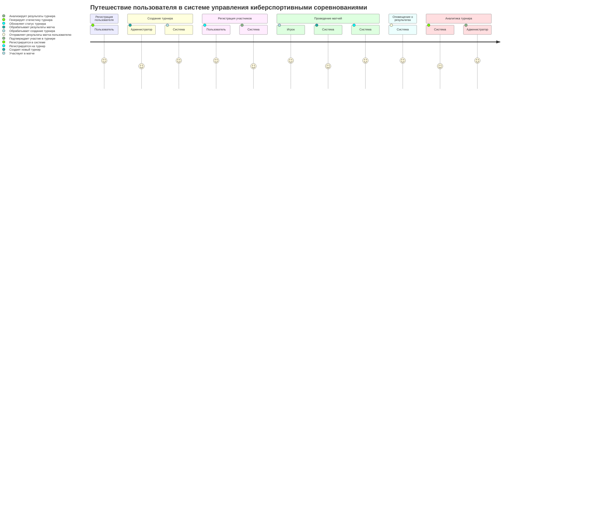

# Веб-приложение для управления киберспортивными соревнованиями

## Описание проекта
Данный проект представляет собой веб-приложение для управления киберспортивными турнирами. Система позволяет регистрировать пользователей, организовывать турниры, управлять матчами, прогнозировать результаты и предоставлять отчеты.  
Технологический стек: **Spring Boot** для серверной части и **React** для фронтенда.

---

## Диаграммы

### 1. Диаграмма структуры функциональных возможностей (Mind Map)

Эта диаграмма отображает основные функции системы, включая регистрацию пользователей, управление матчами, прогнозирование результатов, матчмейкинг и отчеты. Также указаны ключевые технологии, используемые в проекте.


### 2. Диаграмма путешествия пользователя (User Journey)

Эта диаграмма иллюстрирует путь пользователя в системе — от регистрации до получения результатов турнира.



### 3. Квадрантная диаграмма (Quadrant Chart)

Эта диаграмма показывает распределение функциональных возможностей системы по важности и сложности.


### 4. Диаграмма истории разработки (Git Graph)

Эта диаграмма демонстрирует этапы разработки приложения, включая реализацию микросервисов: user-service, tournament-service, matchmaking-service и analytic-service


```mermaid
gitGraph
    commit id: "Initial commit - Setup project structure"
    commit id: "Added tournament management service"
    branch develop
    checkout develop
    commit id: "Implemented user registration functionality"
    commit id: "Added tournament match management service"
    checkout main
    commit id: "Integrated game server connection (matchmaking)"
    
    checkout develop
    branch feature/user-service
    checkout feature/user-service
    commit id: "Developed user registration microservice"
    checkout develop

    branch feature/tournament-service
    checkout feature/tournament-service
    commit id: "Developed tournament management microservice"
    checkout develop

    branch feature/matchmaking-service
    checkout feature/matchmaking-service
    commit id: "Developed matchmaking service"
    checkout develop

    branch feature/analytics-service
    checkout feature/analytics-service
    commit id: "Developed tournament analytics service"
    checkout develop

    branch feature/notification-service
    checkout feature/notification-service
    commit id: "Developed notification service"
    checkout develop

    checkout main
    commit id: "Integrated all microservices into main"
    checkout develop
    merge feature/user-service id: "Merged user service"
    merge feature/tournament-service id: "Merged tournament service"
    merge feature/matchmaking-service id: "Merged matchmaking service"
    merge feature/analytics-service id: "Merged analytics service"
    merge feature/notification-service id: "Merged notification service"
    commit id: "Final version with all microservices integrated"
    commit id: "Bug fixes and optimizations"

